`LogitsProcessor` 是 `candle-transformers` 中负责将模型原始输出（`logits` 向量）转化为下一个生成 `token` 的核心组件。它封装了基于随机种子 (seed) 的可复现采样逻辑，并集成了温度调节 (Temperature Scaling)、Top-K 采样、Top-P 采样 以及一个内置的重复惩罚 (Repetition Penalty) 机制。

🎯 核心职责

LogitsProcessor 连接模型和最终生成文本，它的主要任务是：

1. 策略封装：接收超参数（温度、Top-K、Top-P），并在每次采样时一致地应用它们。
2. 采样输出：提供一个核心方法 sample，输入模型 logits，返回一个确定的 token ID。
3. 重复惩罚：内部维护一个 context（之前生成 token 的向量），对已出现 token 的 logit 值施加惩罚，以减少重复。

📍 在文本生成流程中的位置

下面是文本生成的一个典型自回归循环，可以清晰地看到 LogitsProcessor 所处的位置：



📊 支持的采样参数

参数	作用	对 Logits 的影响
Temperature	控制采样的随机性。值越低，分布越“尖锐”，模型倾向于选择最高概率的 token；值越高，分布越“平坦”，低概率 token 被选中的机会增加。	logits = logits / temperature
Top-K	将候选 token 限制为概率最高的 K 个，直接将其余 token 的概率设为负无穷。	排序后，仅保留前 K 个 token 的 logit 值。
Top-P (Nucleus)	动态选择候选集：对概率从高到低排序并累加，直到总概率达到阈值 P，直接将其余 token 的概率设为负无穷。	根据累积概率阈值动态过滤。
Repeat Penalty	对在当前上下文 (context) 中已生成过的 token 施加惩罚，以减少模型“卡住”重复输出同一短语的现象。	对已出现 token 的 logit 值除以惩罚系数（通常 penalty > 1.0）。

⚙️ 核心方法 sample 的内部工作流

下面通过一个具体的代码示例，展示 LogitsProcessor 如何初始化并完成一次采样。

```rust
// 导入必要的类型
use candle_core::{DType, Device, Result, Tensor};
use candle_transformers::generation::LogitsProcessor;

fn main() -> Result<()> {
    let device = Device::Cpu;
    
    // 1. 创建 LogitsProcessor
    // 参数依次为：随机种子, 温度, Top-P, Top-K, 重复惩罚系数
    let mut logits_processor = LogitsProcessor::new(299792458, 0.8, Some(0.9), Some(40), 1.1);

    // 模拟模型输出的原始 logits (词汇表大小为 5 的示例)
    let logits = Tensor::new(&[0.1f32, 0.5, -0.3, 1.2, 0.8], &device)?;

    // 2. 调用 sample 方法，获得下一个 token 的 ID
    let next_token = logits_processor.sample(&logits)?;
    // 此次调用内部自动执行了：温度调节 -> Top-P -> Top-K -> 重复惩罚 -> 采样

    println!("采样的下一个 token ID: {}", next_token);
    Ok(())
}
```

sample 方法内部，大致按照以下顺序对 logits 张量进行处理：

1. 温度调节：执行 logits = logits / temperature 操作。当 temperature == 0 时，等价于贪心解码（总是选择概率最高的 token）。
2. 重复惩罚：对当前上下文 context 中所有出现过的 token ID，将其 logit 值除以 repeat_penalty。
3. Top-K 过滤：如果设置了 top_k，将除了概率最高的 k 个 token 之外的所有 token 的 logit 设为负无穷。
4. Top-P 过滤：如果设置了 top_p，对概率降序排序并累加，将累积概率超过 p 的后续所有 token 的 logit 设为负无穷。
5. 多项式采样：对处理后的 logits 应用 Softmax 得到概率分布，然后基于此概率分布进行随机采样，得到最终的 token ID。

💡 实际使用场景与示例

1. 基础用法：在 LLM 推理循环中使用

这是最标准的用法，来自 LLaMA 推理示例。

```rust
// 在生成循环外部初始化，传入随机种子和温度
let mut logits_processor = LogitsProcessor::new(args.seed, args.temperature);

for _index in 0..args.sample_len {
    // ... 构建输入 input ...

    // 模型前向传播，得到 [1, vocab_size] 的 logits
    let logits = llama.forward(&input, index_pos)?;
    let logits = logits.squeeze(0)?; // 去除 batch 维度，变为 [vocab_size]

    // 采样下一个 token
    let next_token = logits_processor.sample(&logits)?;
    
    // 将新 token 添加到序列中
    tokens.push(next_token);
}
```

2. 与固定前缀 (Prompt) 搭配

当使用固定前缀时，需要将整个 prompt 作为初始上下文传入，以便重复惩罚等机制能在正确的语境下工作。

```rust
let prompt = "The future of AI is";
let prompt_tokens = tokenizer.encode(prompt, true).map_err(E::msg)?.get_ids().to_vec();

// ... 预填充 (Prefill) prompt_tokens，得到初始 logits ...
let next_token = logits_processor.sample(&logits)?;
tokens.push(next_token);
```

3. 重复惩罚示例

假设在一个生成循环中，为了避免模型无限重复，可以这样做：

```rust
// 创建时设置重复惩罚系数为 1.2
let mut logits_processor = LogitsProcessor::new(42, 1.0, None, None, 1.2);

// ... 在生成循环中 ...
let next_token = logits_processor.sample(&logits)?;
// `sample` 方法内部会自动将 'next_token' 添加到它的上下文 'context' 中
// 下一次调用时，这个 token 就会被施加重复惩罚
tokens.push(next_token);
```

🧩 与其他组件的关系

- `VarBuilder`：负责加载模型权重并构建模型实例，是生成流程的前置步骤。

- `Tokenizer`：负责将文本与 token ID 序列相互转换，是 `LogitsProcessor` 的上下游组件。

- `Model::forward`：深度学习模型的推理入口，输出 `logits` 作为 `LogitsProcessor` 的输入。

💎 总结

`LogitsProcessor` 是 `candle-transformers` 生成管线中的核心策略执行者。通过封装温度调节、Top-K/Top-P 过滤、重复惩罚和可复现的采样，它为文本生成提供了精细的控制手段。使用时，核心在于正确初始化参数并在生成循环中调用 `sample` 方法。
