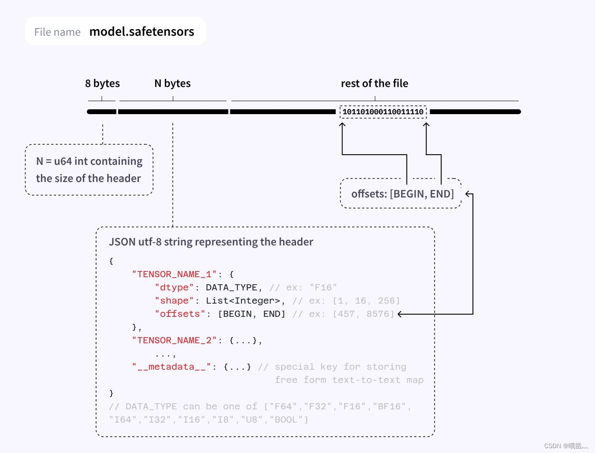

# 一、Safetensors 是什么

Safetensors 是 Hugging Face 在 2022 年推出的安全、轻量、零拷贝的张量存储格式，后缀为 .safetensors，主打替代 PyTorch 的 pickle 权重文件（.pt/.pth/.bin）。

核心口号：只存数据，不执行代码；能 mmap，能零拷贝。

---

# 二、为什么要做 Safetensors（解决什么痛点）

1）Pickle 极其不安全

- PyTorch 的 .bin 用 pickle 序列化，反序列化会执行任意 Python 代码。
- 恶意构造的权重文件可以接管你的机器，社区多次出现恶意模型投毒。

2）Pickle 慢、占内存、不能懒加载

- 加载时必须完整反序列化，大模型（几十 GB）很慢。
- 无法做内存映射（mmap）和零拷贝，无法只加载部分张量。

3）跨框架差、体积大

- Pickle 绑定 PyTorch，TensorFlow/JAX 加载麻烦。
- 元数据冗余，文件通常比 safetensors 大。

---

# 三、文件物理结构（二进制布局，极简）

一个 .safetensors 文件只有三段，连续二进制，无压缩、无加密：

偏移	长度	内容
0–7	8 bytes	Header Size：无符号 64-bit 小端整数，记录 JSON 头部字节数 N
8–(8+N-1)	N bytes	JSON Header：UTF-8 JSON，描述所有张量信息
8+N–EOF	剩余字节	Data Buffer：所有张量的原始二进制数据，连续紧凑排列



关键规则

- Header 必须以 `{`（0x7B）开头，可尾部补空格（0x20）填充对齐。
- Data 部分纯二进制、无 padding、无校验和，完全按 header 偏移量切分。
- Header 最大限制 100MB，防止恶意超大 JSON 攻击。

---

# 四、JSON Header 格式（核心 “文件地图”）

JSON 是一个 dict，每个 key 是张量名，value 包含 dtype、shape、data_offsets；保留键 __metadata__ 存全局信息。

```json
{
  "__metadata__": {
    "format": "pt",
    "model_type": "llama"
  },
  "layers.0.attention.wq.weight": {
    "dtype": "BF16",
    "shape": [4096, 4096],
    "data_offsets": [0, 33554432]
  },
  "layers.0.attention.wk.weight": {
    "dtype": "BF16",
    "shape": [4096, 4096],
    "data_offsets": [33554432, 67108864]
  }
}
```

字段详解

- dtype：数据类型字符串，支持：
  + 浮点：F16/BF16/F32/F64
  + 整数：I8/U8/I16/U16/I32/U32/I64/U64
  + 特殊：FP8（部分框架支持）
- shape：数组，张量各维度大小（如 [4096,4096]）。
- data_offsets：[start, end]，相对于 Data Buffer 起始的字节偏移（非文件绝对偏移）；张量字节数 = end - start。
- __metadata__：可选，字符串→字符串 map，存版本、框架、模型类型等，不能嵌套 JSON。

---

# 五、数据存储细节（Endian、Layout）

- 字节序（Endian）：小端（Little-Endian），主流 x86/ARM 原生字节序，加载无需转换。
- 内存布局：行优先（C-order），与 NumPy/PyTorch 默认一致。
- 对齐：数据自然对齐（如 F16 2 字节对齐、F32 4 字节对齐），mmap 可直接映射为数组，零拷贝。
- 无压缩：原始二进制直接存储，读写最快，但体积与原始数据一致。

---

# 六、核心能力：为什么快（mmap + 零拷贝）

1）内存映射（mmap）

- 文件直接映射到进程虚拟地址空间，不占用物理内存。
- 访问时按需页 fault 加载，首次加载极快（几毫秒级）。

2）零拷贝（Zero-Copy）

- 数据在内存中只存一份，从文件到张量无 memcpy。
- 直接映射为 PyTorch/TensorFlow 张量，无解析、无反序列化。

3）懒加载（Partial Loading）

- 只需读取 JSON header，按需加载单个张量，不用加载整个文件。
- 大模型分片加载、分布式训练效率极高。

---

# 七、Safetensors vs Pickle（.bin）对比

维度	Safetensors	Pickle（.bin）
安全性	安全：纯数据，无代码执行	危险：反序列化执行任意代码
加载速度	极快：mmap + 零拷贝，毫秒级	慢：完整反序列化，秒级
内存占用	低：mmap 虚拟内存，物理内存按需	高：全量加载到物理内存
跨框架	原生支持 PyTorch/TensorFlow/JAX/NumPy	绑定 PyTorch，其他框架需转换
懒加载	✅ 支持，可单张量加载	❌ 不支持，必须全量加载
文件体积	更小：元数据精简	更大：pickle 元数据冗余

实测数据（500MB 权重）：

- Safetensors：3.5ms
- PyTorch Pickle：172.8ms

---

# 八、支持框架与生态

- PyTorch：官方支持，safetensors.torch 直接 load/save。
- TensorFlow：safetensors.tensorflow。
- JAX/Flax：原生支持。
- NumPy：直接映射为 numpy 数组。
- Hugging Face Hub：默认推荐 safetensors，大量模型已迁移。

---

# 九、简单使用示例（Python）

1）安装

```bash
pip install safetensors
```

2）保存张量

```python
import torch
from safetensors.torch import save_file

tensors = {
    "wq": torch.randn(4096, 4096, dtype=torch.bfloat16),
    "wk": torch.randn(4096, 4096, dtype=torch.bfloat16),
}
save_file(tensors, "model.safetensors")
```

3）加载张量（mmap + 零拷贝）

```python
from safetensors.torch import load_file

# 直接映射，零拷贝
loaded = load_file("model.safetensors", device="cuda")
print(loaded["wq"].shape)  # torch.Size([4096, 4096])
```

---

# 十、局限性

- 仅存张量：不能存 Python 对象、优化器状态、训练日志等（训练 checkpoint 仍用 pickle）。
- 无压缩：体积与原始数据一致，超大模型需分片存储。
- 无加密：纯明文二进制，敏感权重需额外加密。

---

# 十一、总结

Safetensors 是大模型时代的权重存储标准：

- 安全第一：彻底杜绝 pickle 代码执行风险。
- 速度极致：mmap + 零拷贝，加载速度提升50–100 倍。
- 极简设计：文件结构清晰，易于实现和验证。
- 生态完善：主流框架全支持，Hugging Face Hub 默认推荐。

一句话：存权重用 safetensors，存训练状态用 pickle。
