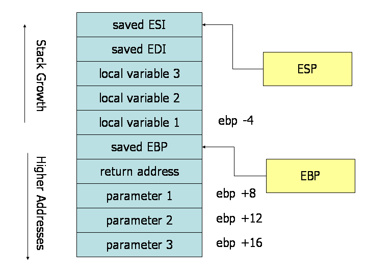

https://www.cs.virginia.edu/~evans/cs216/guides/x86.html




To make a subrouting call, the caller should:

1. Before calling a subroutine, the caller should save the contents of certain registers that are designated caller-saved. The caller-saved registers are EAX, ECX, EDX. Since the called subroutine is allowed to modify these registers, if the caller relies on their values after the subroutine returns, the caller must push the values in these registers onto the stack (so they can be restore after the subroutine returns.

2. To pass parameters to the subroutine, push them onto the stack before the call. The parameters should be pushed in inverted order (i.e. last parameter first). Since the stack grows down, the first parameter will be stored at the lowest address (this inversion of parameters was historically used to allow functions to be passed a variable number of parameters).

3. To call the subroutine, use the call instruction. This instruction places the return address on top of the parameters on the stack, and branches to the subroutine code. This invokes the subroutine, which should follow the callee rules below.

After the subroutine returns (immediately following the call instruction), the caller can expect to find the return value of the subroutine in the register EAX. To restore the machine state, the caller should:

1. Remove the parameters from stack. This restores the stack to its state before the call was performed.

2. Restore the contents of caller-saved registers (EAX, ECX, EDX) by popping them off of the stack. The caller can assume that no other registers were modified by the subroutine.

The code below shows a function call that follows the caller rules. The caller is calling a function _myFunc that takes three integer parameters. First parameter is in EAX, the second parameter is the constant 216; the third parameter is in memory location var.

```
push [var] ; Push last parameter first
push 216   ; Push the second parameter
push eax   ; Push first parameter last

call _myFunc ; Call the function (assume C naming)

add esp, 12
```

Note that after the call returns, the caller cleans up the stack using the add instruction. We have 12 bytes (3 parameters * 4 bytes each) on the stack, and the stack grows down. Thus, to get rid of the parameters, we can simply add 12 to the stack pointer.

The definition of the subroutine should adhere to the following rules at the beginning of the subroutine:

1. Push the value of EBP onto the stack, and then copy the value of ESP into EBP using the following instructions:
    push ebp
    mov  ebp, esp
This initial action maintains the base pointer, EBP. The base pointer is used by convention as a point of reference for finding parameters and local variables on the stack. When a subroutine is executing, the base pointer holds a copy of the stack pointer value from when the subroutine started executing. Parameters and local variables will always be located at known, constant offsets away from the base pointer value. We push the old base pointer value at the beginning of the subroutine so that we can later restore the appropriate base pointer value for the caller when the subroutine returns. Remember, the caller is not expecting the subroutine to change the value of the base pointer. We then move the stack pointer into EBP to obtain our point of reference for accessing parameters and local variables.

2. Next, allocate local variables by making space on the stack. Recall, the stack grows down, so to make space on the top of the stack, the stack pointer should be decremented. The amount by which the stack pointer is decremented depends on the number and size of local variables needed. For example, if 3 local integers (4 bytes each) were required, the stack pointer would need to be decremented by 12 to make space for these local variables (i.e., sub esp, 12). As with parameters, local variables will be located at known offsets from the base pointer.

3. Next, save the values of the callee-saved registers that will be used by the function. To save registers, push them onto the stack. The callee-saved registers are EBX, EDI, and ESI (ESP and EBP will also be preserved by the calling convention, but need not be pushed on the stack during this step).

After these three actions are performed, the body of the subroutine may proceed. When the subroutine is returns, it must follow these steps:

1. Leave the return value in EAX.

2. Restore the old values of any callee-saved registers (EDI and ESI) that were modified. The register contents are restored by popping them from the stack. The registers should be popped in the inverse order that they were pushed.

3. Deallocate local variables. The obvious way to do this might be to add the appropriate value to the stack pointer (since the space was allocated by subtracting the needed amount from the stack pointer). In practice, a less error-prone way to deallocate the variables is to move the value in the base pointer into the stack pointer: mov esp, ebp. This works because the base pointer always contains the value that the stack pointer contained immediately prior to the allocation of the local variables.

4. Immediately before returning, restore the caller's base pointer value by popping EBP off the stack. Recall that the first thing we did on entry to the subroutine was to push the base pointer to save its old value.

5. Finally, return to the caller by executing a ret instruction. This instruction will find and remove the appropriate return address from the stack.

```
.486
.MODEL FLAT
.CODE
PUBLIC _myFunc
_myFunc PROC
  ; Subroutine Prologue
  push ebp     ; Save the old base pointer value.
  mov ebp, esp ; Set the new base pointer value.
  sub esp, 4   ; Make room for one 4-byte local variable.
  push edi     ; Save the values of registers that the function
  push esi     ; will modify. This function uses EDI and ESI.
  ; (no need to save EBX, EBP, or ESP)

  ; Subroutine Body
  mov eax, [ebp+8]   ; Move value of parameter 1 into EAX
  mov esi, [ebp+12]  ; Move value of parameter 2 into ESI
  mov edi, [ebp+16]  ; Move value of parameter 3 into EDI

  mov [ebp-4], edi   ; Move EDI into the local variable
  add [ebp-4], esi   ; Add ESI into the local variable
  add eax, [ebp-4]   ; Add the contents of the local variable
                     ; into EAX (final result)

  ; Subroutine Epilogue 
  pop esi      ; Recover register values
  pop  edi
  mov esp, ebp ; Deallocate local variables
  pop ebp ; Restore the caller's base pointer value
  ret
_myFunc ENDP
END
```
